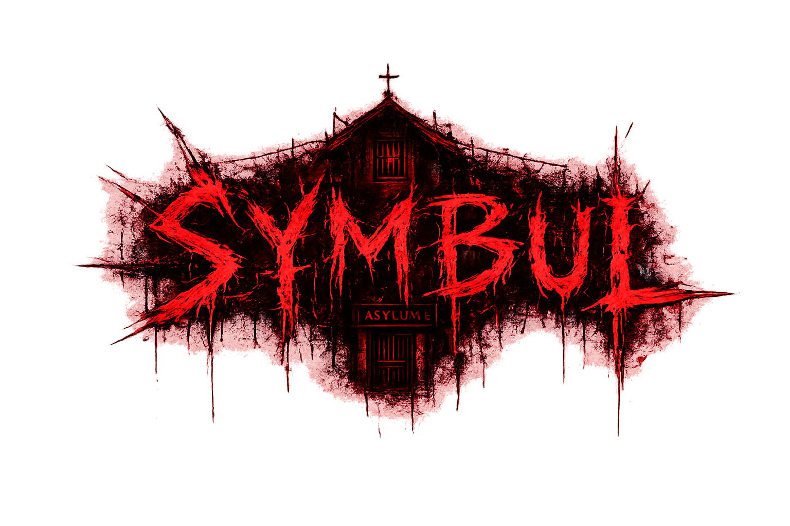
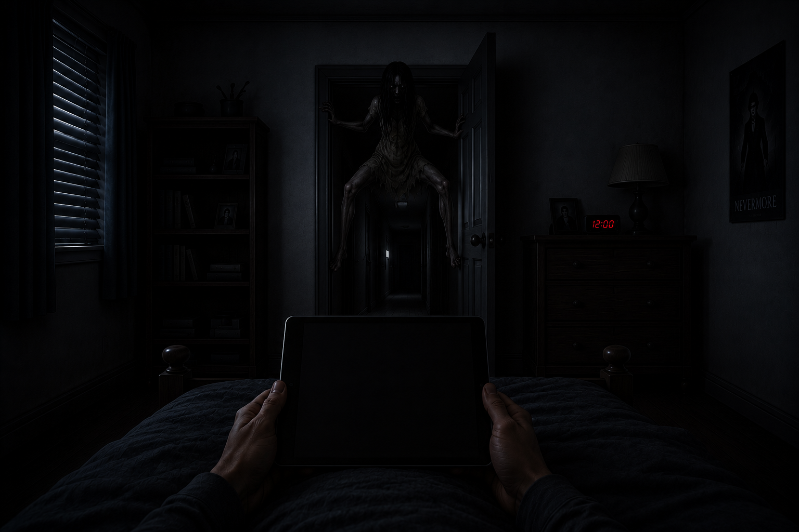

# 👁️ Symbul Horror

<p align="center">
  
</p>

**Symbul Horror** is a first-person survival horror game developed using the **Godot Engine**. Inspired by CCTV-style horror games, players must monitor multiple rooms through security cameras, manage limited resources, and survive against a mysterious entity that lurks throughout the building.

This repository contains the **demo version** of the game, featuring the core gameplay mechanics, atmospheric horror elements, and an introduction to the world of **Symbul Horror**. The demo is designed to showcase the game's mechanics while giving players a preview of the upcoming full release.

---

# 🎮 Gameplay

Players use a CCTV monitoring system to observe different rooms and detect the movement of a hostile entity. Success depends on paying close attention to camera feeds, reacting quickly to threats, and managing limited power while surviving until the end of the night.

As tension builds, unexpected events, disturbing sounds, and intense jump scares create an immersive horror experience.

---

# ✨ Demo Features

- 📹 CCTV camera monitoring system
- 🏠 Four playable rooms
  - Bedroom
  - Hallway
  - Basement
  - Storage Room
- 👁️ One unique enemy entity
- 🔋 Power and generator management
- 🔊 Dynamic ambient horror audio
- 💀 Random jump scares
- 🎮 Interactive gameplay mechanics
- 🎨 Developed using Godot Engine and GDScript

---

# 📸 Screenshots

## Main Gameplay



```

---

# 🚀 Getting Started

## Requirements

- Godot Engine 4.x

## Installation

Clone the repository:

```bash
git clone https://github.com/YOUR_USERNAME/symbul-horror.git
```

Open the project:

```text
project.godot
```

Run the project by pressing **F5** inside the Godot Editor.

---

# 🎯 Controls

| Action | Key |
|---------|-----|
| Interact | Left Mouse Button |
| Open CCTV Tablet | Left Mouse Button |
| Switch Cameras | Mouse |
| Close CCTV | Left Mouse Button |

---

# 🛠️ Built With

- Godot Engine 4
- GDScript
- Godot Scene System

---

# 🚧 Upcoming Full Version

The full version of **Symbul Horror** is currently in development and will significantly expand upon the demo with new gameplay mechanics and content.

### Planned Features

- 👹 **8 unique enemy entities**, each with different AI and behaviors
- 🏢 More playable rooms and larger environments
- 📹 Additional CCTV cameras and monitoring locations
- 📖 Story mode with expanded lore
- 🎭 Multiple endings
- 🔋 New survival mechanics
- 🎵 Improved ambient audio and soundtrack
- 🎬 Better animations and visual effects
- 💾 Save and load system
- 🎮 Improved gameplay balance and optimization

---

# 🗺️ Roadmap

- ✅ Core CCTV gameplay
- ✅ Enemy AI
- ✅ Generator system
- ✅ Demo release
- 🔄 Additional entities
- 🔄 New maps
- 🔄 Story mode
- 🔄 Save system
- 🔄 Full game release

---

# 🤝 Contributing

Contributions, suggestions, and bug reports are welcome.

If you find a bug or have ideas to improve the game, feel free to open an Issue or submit a Pull Request.

---

# 📜 License

This project is licensed under the **MIT License**.

---

# 👨‍💻 Developer

Developed using **Godot Engine** as a personal horror game project and learning experience in game development.

Thank you for playing the **Symbul Horror Demo**!

⭐ If you enjoyed the project, consider starring the repository to support future development.
